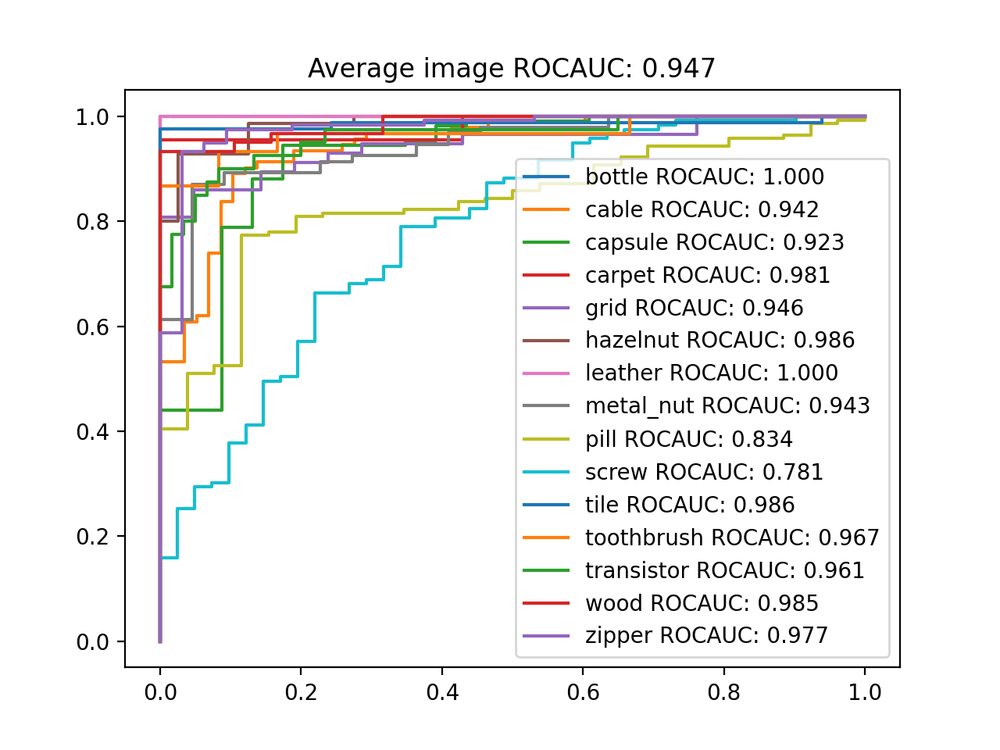

# Modeling the Distribution of Normal Data in Pre-Trained Deep Features for Anomaly Detection in PyTorch

PyTorch implementation of [Modeling the Distribution of Normal Data in Pre-Trained Deep Features for Anomaly Detection](https://arxiv.org/abs/2005.14140).  

This paper presents an anomaly detection approach that consists of fitting a multivariate Gaussian to normal data in the pre-trained deep feature representations, using Mahalanobis distance as anomaly score.  
It is a simple yet effective approach and achieves SOTA on `MVTec AD` dataset.  

## Prerequisites
* python 3.6+
* PyTorch 1.5+
* efficientnet_pytorch, sklearn, matplotlib

Install prerequisites with:  
```
pip install -r requirements.txt
```

If you already download [`MVTec AD`](https://www.mvtec.com/company/research/datasets/mvtec-ad/) dataset, move a file to `data/mvtec_anomaly_detection.tar.xz`.  
If you don't have a dataset file, it will be automatically downloaded during the code running.

## Usage

To test this implementation code on `MVTec AD` dataset:
```
cd src
python main.py
```

After running the code above, you can see the ROCAUC results in `src/result/roc_curve_{model_name}.png`

## Results

Below is the implementation result of the test set ROCAUC on the `MVTec AD` dataset.  

| | Paper | Implementation |
| - | - | - |
| bottle | - | 100.0 |
| cable | - | 94.2 |
| capsule | - | 92.3 |
| carpet | - | 98.1 |
| grid | - | 94.6 |
| hazelnut | - | 98.6 |
| leather | - | 100.0 |
| metal_nut | - | 94.3 |
| pill | - | 83.4 |
| screw | - | 78.1 |
| tile | - | 98.6 |
| toothbrush | - | 96.7 |
| transistor | - | 96.1 |
| wood | - | 98.5 |
| zipper | - | 97.7 |
| Average | 94.8 | 94.7 |

### ROC Curve 



